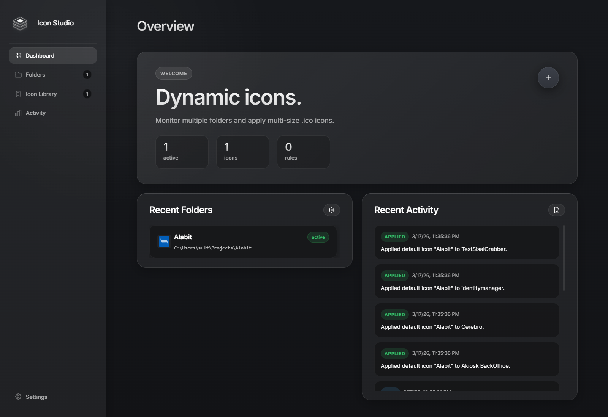
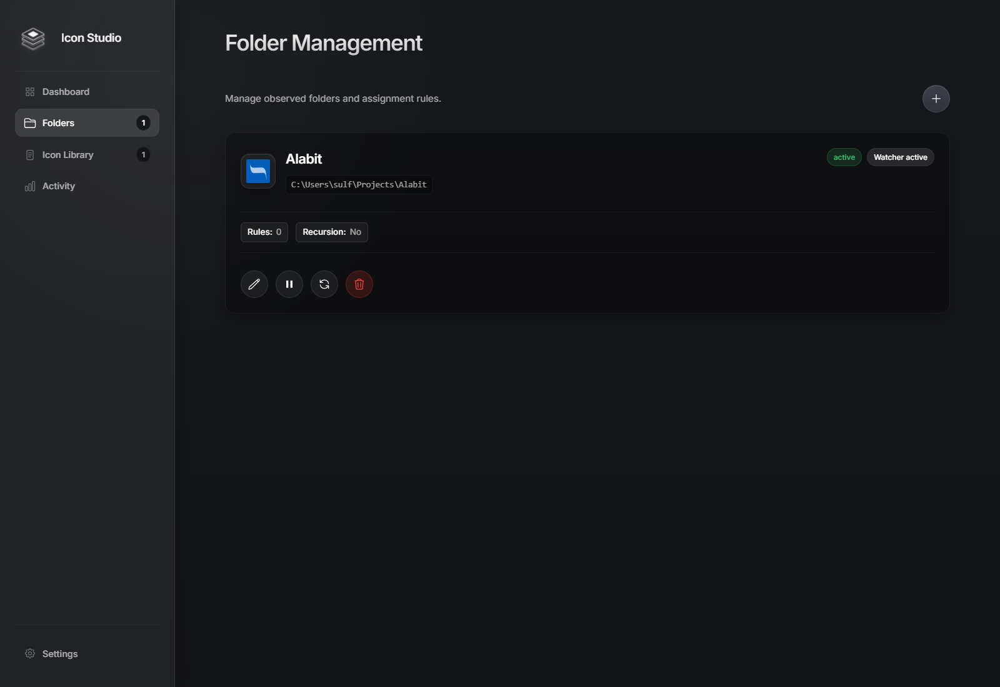
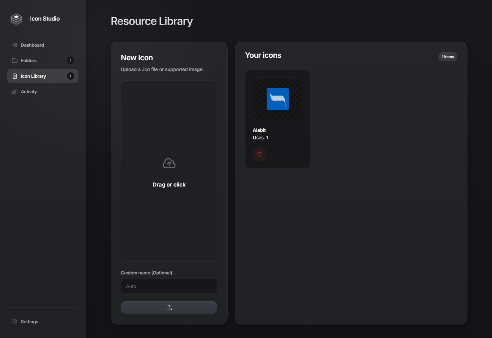
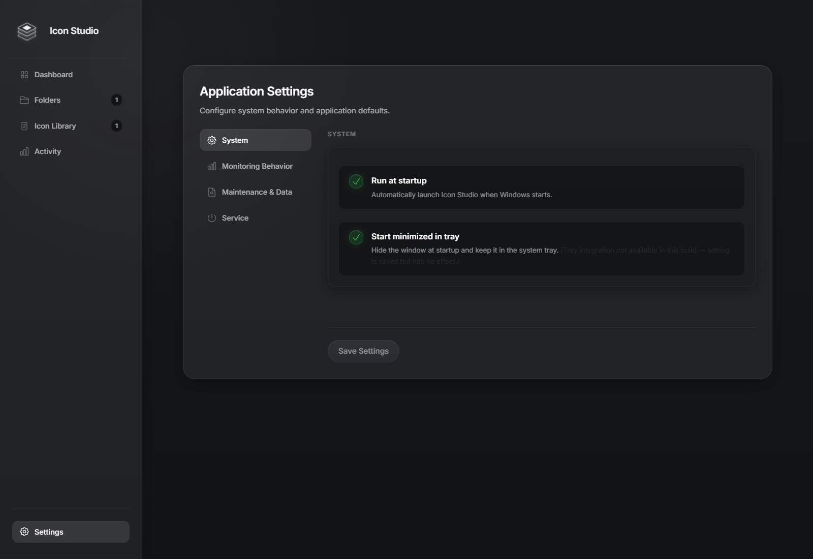

# Icon Studio

Icon Studio is a local-first Windows desktop app that watches folders and assigns custom icons automatically.

It combines a Fluent-style Electron desktop shell, a React control panel, and a local Node.js backend that updates folder icons directly on your PC using `desktop.ini` and standard Windows folder attributes.



## Why Icon Studio

- Watch one or more folders at the same time
- Apply a default icon to every new subfolder
- Match folder name prefixes and assign rule-based icons automatically
- Manage a reusable icon library with multi-size `.ico` assets
- Keep everything local on Windows, without cloud dependencies
- Avoid overwriting folder customizations that were created by other tools

## What It Does

Icon Studio is built for people who keep large project folders, clients, automations, scripts, vaults, or workspaces on disk and want them to stay visually organized.

You choose a root directory, assign a default icon, optionally define keyword rules, and let Icon Studio monitor the folder in the background. When a matching folder appears, the backend updates the folder icon directly on Windows.

## Screenshots

### Dashboard


### Folders



### Icon Library



### Settings



## Core Features

### Folder Monitoring

- Monitor multiple root folders in parallel
- Optional recursive monitoring
- Runtime service control from the app
- Soft restart support when monitoring settings change

### Rule-Based Icon Assignment

- Default icon per watched folder
- Keyword prefix rules for specific folders
- Automatic icon application to new folders
- Optional startup re-scan

### Icon Library

- Upload `.ico` files directly
- Convert supported image formats into multi-size `.ico`
- Reuse icons across multiple watched folders
- Visual icon picker in folder setup flows

### Desktop Experience

- Windows desktop app with tray integration
- Start minimized support
- Native installer and portable packaging
- Dark Fluent-inspired shell

## How It Works

Icon Studio stores your icons in a local library and points Windows folders to those assets through `desktop.ini`.

To stay as non-invasive as possible:

- existing unmanaged custom folder icons are not overwritten
- hidden and system items can be ignored by configuration
- icon files are centralized instead of duplicated into every folder

## Tech Stack

- `desktop/`: Electron shell for Windows
- `web/`: React + TypeScript + Vite
- `backend/`: Node.js + Express + Chokidar

## Run Locally

```bash
npm install
npm run dev
```

Useful scripts:

- `npm run dev`: Electron desktop app in development
- `npm run dev:web`: backend + web UI without Electron
- `npm run build`: production web build
- `npm run dist:win`: build the Windows installer
- `npm run dist:win:portable`: build the portable Windows executable

## Build Windows Releases

Classic installer:

```bash
npm run dist:win
```

Portable executable:

```bash
npm run dist:win:portable
```

Artifacts are written to `release/`.

## Install From GitHub Release

1. Open the [Releases page](https://github.com/sulfur/Icon-Studio/releases).
2. Download the latest `Icon-Studio-Setup-*.exe` installer from the release assets.
3. Run the installer and complete the setup wizard.
4. Launch `Icon Studio` from the Start Menu or desktop shortcut.

If Windows SmartScreen appears, click `More info` and then `Run anyway` for unsigned builds.

## Windows Notes

- Windows Explorer may take a few seconds to refresh icon cache changes
- Some protected folders can block `desktop.ini` updates
- Unsigned builds may trigger SmartScreen warnings on other machines

## Project Status

Icon Studio is designed for Windows and focuses on local folder icon automation, background monitoring, and an integrated desktop management UI.
